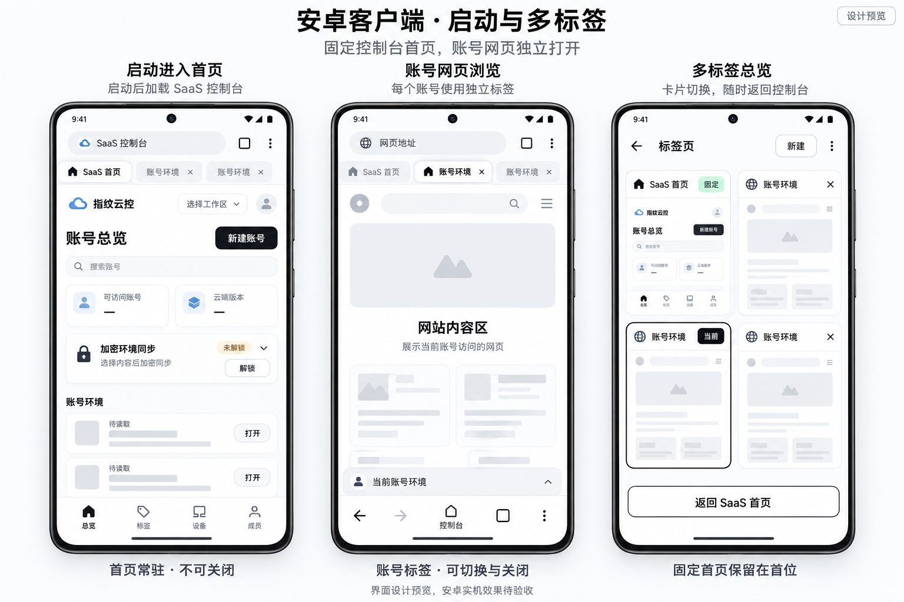

# Windows 与 Android 跨平台闭环开发计划

更新日期：2026-10-04。首版范围经用户确认：Windows 桌面端 + Android；Linux/macOS 纳入后续路线。第一目标是打通真实多账号隔离与云端同步闭环，商业配额、计费和新存储类别排在该目标之后。

本计划安排后续工作，不代表本次已授权 Chromium 全量编译、参数调整、工具安装或生产部署。实施遵守 [开发规则](development-rules.md) 与 [AGENTS.md](../AGENTS.md)；当前事实与证据见 [项目总览](../PROJECT-OVERVIEW.md)。

## 1. 首版交付标准

交付同一套独立 SaaS Web、Go 服务及 PostgreSQL，配套 Windows 原生客户端和 Android 原生客户端。用户在真实工作区创建至少两个账号，可在各端打开独立环境、使用账号配置访问网站、选择类别加密上传并在另一端恢复；冲突、失权、断网和部分失败均展示真实状态。

首版要求：

1. 同机账号间持久存储、网络和受支持指纹不串号；常驻控制台、单账号单活跃 Tab、普通关闭/重新打开正常。
2. Windows → Android、Android → Windows 双向恢复真实数据；账号标识、版本、所选类别、密码与平台兼容边界得到验证。
3. 页面与 Worker 的受支持指纹及真实请求头/代理出口符合声明。未实现项明确不可用，不以配置回读代替效果。
4. 越权来源、错误密码、篡改密文、跨账号快照、版本竞争与已撤销会话不能完成危险操作。
5. 两端使用最新对应产物完成验证，保留参数、源码、补丁、产物哈希与失败边界；旧 Development 或历史 JVM 通过不计入首版平台验收。
6. 具备可重复部署、受控初始化、备份恢复和安装升级依据。计费功能不作为技术闭环的前置条件；公网运营前另过运营准备门槛。

异常关闭后的自动批量恢复保持低优先级；Android 正常生命周期、端口撤销、进程被回收后的分区身份安全仍是首版必要项，不能一并延期。

## 2. 现场基线与阻塞

| 项目 | 本次核对结果 | 对计划的影响 |
| --- | --- | --- |
| SaaS Web | 最新 41 项回归通过；指纹恢复采用统一参数校验/能力检查/应用后回读，页面选择可控制恢复范围 | 从真实客户端联调入手，无需重建业务架构 |
| Go | `go test -v ./...`、`go vet ./...` 通过；包测试含缓存；独立 PostgreSQL 专项跳过 | 真实数据库复测是闭环前置条件，历史通过不替代 |
| Windows | Release 图存在；程序/动态库与 publish 为 2026-09-30 产物 | 需要使最新实现进入运行产物后再验收 |
| Android | WSL Ubuntu Running；活跃输出 `/home/gaoyang/chromium-build/AndroidDevelopment` 已完成 `chrome_public_apk`，APK 376,929,667 字节，SHA-256 为 `4fcef918767a26d91ea6562f7fb89bdd53442be5e05a48425b4a3964dc8dad9e`；设备仍未验收 | 从 APK 构建转入安装、权限、生命周期、网络/存储和指纹运行效果，保留独立输出与缓存 |
| Linux 工具 | Ninja 1.11.1、OpenJDK 17.0.20.1；depot_tools GN 启动器存在，常用源码 `buildtools/linux64/gn` 缺失 | 尚不能宣称 GN 可用，核实真正可执行工具，不自动下载 |
| 补丁 | `build-compatibility.patch` 已通过格式/当前源码反向检查；`missing-dependencies.patch` 已恢复到提交版本，`git apply --numstat` 通过，但当前展开源码反向检查仍受源树漂移影响 | 在干净源树独立重放并核对补丁顺序；格式已收口，不能把当前展开源码反向失败记作补丁格式失败 |
| 同步并发 | Web 与 Go 均要求具体版本，服务端已拒绝 `If-Match: *` | 继续补充真实 PostgreSQL 竞争、撤权和审计验证 |
| 审计与撤权 | 云端 API 已校验权限；快照提交后单独写审计，部分本地动作缺完整上报 | 补齐云端/在途同步停止验证与审计，已打开本机 Tab 按确认策略保留使用 |

现场源码/配置可能由其他开发任务继续更新。以上是本次分析时的快照，任务开始时重读状态；目录存在不表示版本适配通过，不按旧结论覆盖配置。

## 3. 依赖与执行顺序

```text
M0 基线与契约收口
 ├─ M1 Windows 原生构建准备 → 最新产物 → 单端验收
 ├─ M2 Android 环境/源码准备 → Java/JNI/C++ → APK → 单端验收
 └─ M3 真实 SaaS 部署与数据库 → 并发/权限/同步故障验证
                    ↓ 三路前置条件均满足
M4 Windows ↔ Android 双向恢复与一致性验收
                    ↓
M5 发布、升级、备份恢复与稳定性验收
                    ↓
M6 商业运营能力、扩展同步、Linux/macOS
```

Windows、Android 与 SaaS 的准备工作可以交错推进，Android 不等待 Windows 完全交付才启动。每个任务先完成必要编码与局部验证；需要全量构建的节点按强制锁独立报告并获得指令。无排期人员、容量与构建实测基线时不编造完成日期或工时。

## 4. M0：建立可执行基线与收口关键语义（最高优先级）

### T01 产品决策与能力/兼容矩阵

- 范围：总览、桥/同步协议、Web 能力展示及各端配置验证入口。
- 交付：全部指纹参数严格复现的兼容检查与拒绝恢复流程，以及退出/撤权策略；字段级矩阵记录 UA/UA-CH、硬件、种子、基础指纹表面、代理、存储类别、文件、HTTP、安全存储的支持/限制/验证状态。
- 当前实现：Web 按两端统一字段/范围校验种子、UA、硬件并发数；读取真实目标桥能力，选中指纹恢复时应用并回读账号和配置值，在导航与存储写入前停止漏写或静默改值。旧 `fingerprint_contract` 或 Worker 未验收标记不阻断合法参数恢复。仍需完成页面/请求/Worker 实际效果验收。
- 契约设计：PC 与 Android 全部指纹参数统一，新增字段两端同步实现，不设平台差异降级；版本演进评估旧快照和旧客户端，保留历史密文与原值。参数格式校验、原生能力可用性、配置回读和运行效果分别验证。
- 验收：每项明确“当前已支持或待实现”，两端字段、范围与语义一致；恢复前校验格式/能力，网站导航前核对实际配置，失败提示客户端缺陷。不得以 Worker 状态为由拒绝参数恢复，不静默改写或向不支持端发送假成功；回读不能代替网络/页面效果验收。
- 依赖：用户已确认 Windows + Android、闭环优先、全部参数严格复现，并进一步明确两端不应有参数不兼容；某端缺失须补齐实现。同时保持退出/撤权后停止云端业务而保留本机 Tab 继续使用的策略。

### T02 补丁与源码可重复性

- 范围：`patches/series`、失败补丁、`android-bridge/` 与 `build/src/` 对应实现；不修改全局编译参数。
- 交付：局部修正格式/上下文与平台源清单问题；逐项记录源文件、模块副本、补丁的一致性；核对已出现的 `TabImpl.java` 与此前未应用的调用保护。
- 当前结果：`build-compatibility.patch` 的纯上下文伪 hunk/缺失空白已最小修复，格式检查及当前源码反向检查通过；`missing-dependencies.patch` 已移除工作区追加的重复/损坏 hunk，恢复为提交版本，格式检查通过。当前展开源码含其他补丁改动，反向检查在既有依赖上下文处失败，需在干净源树重放确认。
- 验收：关键补丁格式和上下文检查通过；在独立验证工作区按项目真实预处理/补丁顺序重放，不覆盖现有展开源码和缓存。当前无法对全部补丁完成重放，T02 保持局部通过、整体未完成，列出具体限制。
- 风险：`missing-dependencies.patch` 的独立重放仍未在干净源树完成；当前展开源码的漂移/重叠补丁不能作为重放通过证据。GN 公共配置/参数变化仍单独审批。

### T03 并发与权限契约收口

- 范围：Go 快照/账号授权、Web 操作上下文、协议与已有测试。
- 交付：已收口 `If-Match: *` 无条件覆盖路径，统一明确覆盖的具体版本校验；继续复核权限检查与提交事务间的竞争、账号删除/最后显式成员删除语义、5 分钟租约失效行为。指纹统一参数及恢复回读按 T01 处理。
- 验收：直接 API 调用也无法静默覆盖未读取的新版本；用户失权后新提交失败；租约不能冒充全局运行独占。必须覆盖并发撤权/删除/覆盖与审计结果。现有单元/集成用例已覆盖通配版本拒绝和具体版本覆盖，真实 PostgreSQL 运行仍需独立测试库。
- 限制：现有 API 行为兼容调整需要文档与旧客户端评估，不直接删历史接口或凭证。

M0 出口：产品语义有明确记录，格式/副本问题有可复现结论，最危险的版本与权限例外有实现或明确阻塞；不能以文档完成作为源码问题已经修复。

## 5. M1：Windows 最新原生实现与单端闭环（最高优先级）

### T04 Release 构建准备与增量评估

- 范围：只读核对 Release 实际参数、图、依赖记录、D 盘工具链及最新源码差异。
- 交付：参数/模板差异清单、未进入图的已批准配置、目标依赖和预估源文件/编译单元及生成/链接范围。最小源码修复保持原有参数。
- 验收：可解释现有图与配置是否匹配；局部检查有结果；只有获得对应构建指令后才重生成必要图/链接。报告未知项，不拿旧 54340 步干跑当当前估算。
- 依赖：T02；参数差异需要当前专门确认，不能“统一配置”自动覆盖。

### T05 最新 Windows 程序与单端验收

- 交付：含目标改动的 Release 程序/动态库及来源与哈希；真实原生桥、Tab、存储、网络、文件、指纹报告。
- 壳设计编码已完成：启动加载/关闭保护/账号打开已有源码；原生管理 Tab 已改为普通宽度渲染并拦截再次 pinned，SaaS 已编码窄导航轨、工作区筛选栏、真实标签分组和页面内 Tab 条。首个管理 Tab 不提供“×”。源码与设计的逐项状态见 [浏览器壳计划](saas-browser-shell-plan.md)，原生 TabStrip 与页面内 Tab 条分开实现/验收。
- 验收：完成第 9 节适用 Windows 用例；正常导航、跨账号隔离、来源拒绝、指纹首请求、代理、Worker 和中文失败提示均有实际证据。平台构建/链接成功后才记“构建通过”。
- 风险：ThinLTO 与公共告警命令变化可能扩大增量，不能预设“只链接即可”或自行切换组件/优化模式。

M1 出口：最新 Windows 单端打开—隔离—读取/恢复—关闭可运行；服务端及 Android 尚未通过的项目继续标明，不提前记录跨平台完成。

## 6. M2：Android 可重复构建与设备闭环（最高优先级）

### 安卓界面设计参考（2026-10-05）

采用 [安卓 SaaS 启动与多标签高保真效果图](../design/android-saas-multitab-hi-fi.png) 作为 T07 界面实现与 T08 设备验收的参考，覆盖“启动进入 SaaS 首页 → 账号网页浏览 → 多标签总览”三个状态。



- SaaS 页面：沿用浅色主题，移动工作区入口、账号卡片、同步区域和底部导航在 `saas-web/` 实现，接入真实接口；图中空值与骨架仅表达未读取状态，不作为业务数据。
- 安卓原生外壳：启动创建或激活唯一固定 SaaS 首页，不提供关闭入口；账号标签独立打开、切换与关闭，多标签总览保留固定首页与返回入口。顶部标签条、卡片总览和浏览器工具栏按 Android 实际控件与屏幕空间落地，不照搬桌面 TabStrip。
- 状态边界：此图是目标设计参考，尚不代表新增原生视觉已实现或实机通过；首次无有效会话时展示真实登录页，已有有效会话时进入工作台。账号网页不显示 SaaS 页内底部导航。仅视觉参考不改变桥契约、平台能力声明或构建授权。

### T06 WSL 环境、源码与构建入口核实

- 范围：WSL Ubuntu、Linux GN/Ninja、实际 Chromium Android SDK/NDK/JDK 工具调用链、Android ARM64 输出/缓存。
- 交付：已安装与实际可执行版本、路径、ABI、目标清单、源码/依赖缺口；比较 Android 模板与实际 `args.gn`，不覆盖任何差异。
- 验收：在 WSL 内确认 GN 真正可执行、SDK/NDK/JDK 与本项目调用链兼容；不存在构建图时明确需要生成及范围。仅有 depot_tools 启动脚本或 SDK 目录不算通过。
- 限制：不自动安装、换工具链、改路径或构建参数；出现必要变更提交具体方案确认。WSL 现在已运行，不再把历史虚拟化失败作为当前阻塞。
- 当前结果：既有 WSL 活跃输出完成原地 GN 重生成，构建图记录 57,663 个目标、4,068 个输入文件；Android ARM64 `base/check.cc` 单编译单元命令实际返回 0，ELF 机器类型为 AArch64。该结果未覆盖完整源码、链接、APK 或设备验收。

### T07 Java/JNI/C++ 集成与 APK

- 范围：消息宿主、TabModel/TabCreator/TabRemover、JNI 签名、Android 原生状态/分区/HTTP/存储、SAF/Keystore、源清单。
- 交付：先局部类型/目标检查，修复实际平台错误并同步补丁；编码收口后按批准范围构建实际 Android 目标和可安装 APK，记录 ABI/签名/哈希。AAB 在分发需要时单列，不假定独立 Gradle 工程必须存在。
- 界面交付：对照本节高保真图，分别记录 SaaS 移动页面与 Android 原生外壳的已实现、待实现和实际差异；复用已有启动与标签逻辑，原生修改同步模块副本、展开源码及对应补丁。
- 验收：真实 Android 工具链完成 Java/JNI/C++ 编译及链接/打包；未绑定平台声明能力不可用；不引用桌面专属实现或用 Windows C++ 检查代替 Android 结果。
- 依赖：T02、T06；整体构建需要专门指令。
- 当前结果：真实 Java/JNI/C++ 集成、资源生成、链接和用户确认的 `ninja -j 8 chrome_public_apk` 已完成；已修复冗余 `-licu` 链接声明并登记 Android 补丁，未改变 Android 编译参数。APK 来源、大小和哈希已记录在阶段总结；T07 仍需补充安装/签名策略与设备运行验收，不能把 APK 构建等同于设备通过。

### T08 Android 真机与生命周期

- 交付：目标 Android 版本/设备/ABI 清单、正常使用和生命周期报告。
- 界面验收：以最新 APK 和真实账号提供三种设计状态的设备截图；核对启动选中唯一首页、首页不可关闭、重复打开同账号仅激活已有标签、账号标签关闭不删除目录/快照、返回控制台以及多标签和窄屏下可操作性；补验登录、加载、空目录、失败状态，不用骨架或效果图替代运行证据。
- 验收：消息端口真实授权/撤销、同账号幂等、固定分区、正常冻结/恢复、后台切换、旋转/Activity 重建、系统进程回收后的安全重新连接；旧代次请求不能执行新文档动作。
- 系统能力：SAF 首次授权/撤权/取消、提供方不支持安全覆盖；Keystore 密钥缺失/失效、凭据清理失败；账号 HTTP 凭据、代理、重定向/TLS、并发/容量/超时。
- 边界：不保证被系统回收后自动重新打开所有账号；但不能恢复到共享分区、复活旧授权或丢失正常持久数据。

M2 出口：至少一个明确记录的真实 Android 设备通过必要项，已构建 APK 来源可追溯；模拟器辅助验证不替代声明真机已通过。

## 7. M3：真实 SaaS 服务、权限与同步一致性（最高优先级）

### T09 HTTPS 与真实 PostgreSQL 验证环境

- 交付：设备可访问的实际 HTTPS 测试服务、独立数据库、受控首用户与工作区、两端启动地址/白名单/API/CSP 的配置一致性清单。
- 验收：两端可访问真实服务；生产密钥不进入仓库/日志/包；`SAAS_TEST_DATABASE_URL` 下实际跑通专项；白名单以完整 Origin 检查。Android 回环地址不当作 Windows 服务。
- 依赖：域名/证书、测试数据库和设备网络信息在实施时确认，不虚构部署地址；修改白名单编译参数须独立审批。

### T10 停止失效身份的云端操作并保留本机浏览

- 范围：Web 操作编排、会话/角色/账号 API、在途同步/恢复的上下文与原生副作用；已打开本机账号 Tab 保留使用，不新增强制关闭策略。
- 交付：退出、设备撤销、成员移除、账号权限变化后停止旧身份的 SaaS 云端业务；在途同步/恢复停止后续业务请求及相关本地恢复写入，保留账号 Tab 正常浏览、导航与网站网络访问；必要会话撤销/租约清理、桥失联与离线状态分别提示。
- 验收：旧身份不能继续上传、下载或从云端恢复受限账号；已打开本机 Tab 不被自动关闭、清空分区或中断独立浏览。原生来源/系统授权仍严格校验，旧凭据不复活。不能宣称无法联网的远端设备立即收到撤销；须定义云端撤权检测机制与时限，设备获知后停止相关业务。
- 依赖：T01、T03；若现有桥足够，先只改 SaaS；确需原生授权约束则联动两端契约，不把业务登录复制进内核。

### T11 版本、审计与恢复故障

- 交付：真实数据库并发、快照上传/读取、租约、合并/覆盖、密码错误、篡改、容量、断网、部分写入、重试报告；快照提交与对应审计已纳入同一服务端事务，继续补齐其他必要动作的审计设计与实现。
- 验收：云端版本始终单调、拒绝陈旧提交；快照提交与审计失败不产生不可解释结果；导入/导出/恢复/删除/设备操作的记录范围明确。数据库、服务端及客户端日志均无敏感明文。
- 特别检查：Cookie 写入前的网站首请求、LocalStorage 来源加载与受控重载、SessionStorage 恢复语义；第三方不接受旧会话时提示重新登录，不把 JSON 写入成功当网站登录成功。

M3 出口：真实数据库及权限/并发/故障场景通过，服务地址与来源配置可重复；公网生产化的容量与多实例限制另列，不冒充已完成。

## 8. M4/M5：跨平台验收与可交付版本

### T12 双向同步与受支持指纹一致性

前置条件：M1、M2、M3 的必要项均通过，T01 平台兼容策略已实现。

执行完整路径：Windows 创建账号 A/B → 同来源写不同真实数据 → 选择类别加密上传 → Android 恢复并验证隔离/配置/真实请求 → Android 修改并提交新版本 → Windows 读取新版本恢复 → 并发制造冲突并验证明确处理。

验收以第 9 节为准，保存实际两端版本、设备、服务/数据库、快照版本及结果。配置不兼容、第三方重新登录、容量限制或部分失败必须明确，禁止静默丢弃数据。对受支持字段做同平台稳定性与跨平台声明一致性验证，不承诺未验证的“全指纹相同”或网站风控结果。

### T13 发布、升级、备份恢复与稳定性

- 交付：固定名称 SaaS 包、Windows 安装/升级流程、Android 签名 APK/升级流程、版本/兼容清单、数据库及本地数据备份恢复指引。
- 验收：升级后账号标识/分区不变、云端密文可读、旧客户端不兼容时明确提示；回滚保留账号和版本历史；Android 安装升级不意外使 Keystore 凭据失效，失效有重新登录流程。
- 稳定性：记录目标设备的多账号并行内存/响应、同步密文大小、网络超时、后台恢复及持续运行结果；先测基线再确定支持账号数/容量，不写无依据的“无限账号”。
- 部署：HTTPS、秘密管理、备份与恢复演练、错误/租约/冲突可观测性、单进程限流的代理来源策略。多实例上线前先有一致的限流/迁移方案。
- 限制：当前 GitHub tag 工作流只创建空 Release，不代替以上构建/测试/签名发布；本任务不触发标签或外部发布。

M4 出口：Windows ↔ Android 双向闭环通过。M5 出口：可安装、可升级、可恢复、版本可追溯，关键隔离/权限/数据丢失缺陷全部关闭；才能标记首版“可发布”。

## 9. 首版真实验收矩阵

| 标识 | 场景 | 合格结果 | 执行范围 |
| --- | --- | --- | --- |
| A01 | 冷启动、正常重启、关闭/批量关闭、应用退出 | 唯一常驻控制台，账号 Tab 幂等，正常退出可完成 | Windows、Android 各自 |
| A02 | 两账号同来源存储及缓存/SW | Cookie/网页存储/IndexedDB/缓存/SW 不串号，重新打开身份稳定 | 两端；后两类只验隔离 |
| A03 | `window.open`、`target=_blank`、POST、历史导航 | 遵守单页策略，账号不换分区，不额外重放 POST | 两端各自 |
| A04 | UA/UA-CH、硬件/种子、页面与四类 Worker | 受支持字段、首次请求和重载后结果符合声明；未验项不报 true | 两端各自 |
| A05 | 双账号不同代理、代理故障/认证/TLS/重定向 | 实际出口正确，无串号/静默直连/凭据泄漏 | 两端各自 |
| A06 | 错误来源、嵌入、导航、替换 WebContents、旧回复 | 无授权来源不能调用；旧端口/代次不能修改新文档 | 两端各自 |
| A07 | Cookie/LocalStorage/SessionStorage 分类往返 | 所选数据正确，未选项不覆盖，来源与账号校验有效 | 双向跨设备 |
| A08 | 两端统一指纹参数往返、漏写/改值、无效字段与超容量 | 合法参数同值恢复；漏写/静默改值作为实现缺陷停止后续写入；无效字段/能力缺失/超容量明确报错，未选数据不丢失 | Windows ↔ Android |
| A09 | 错误密码、篡改、跨账号/不支持格式 | 明确拒绝，无半份提交、无明文泄漏 | Web + 两端 + API |
| A10 | 并发上传/租约到期/再次冲突 | 陈旧提交失败，明确覆盖仍校验具体版本，无无条件覆盖 | 真实 PostgreSQL + 两设备 |
| A11 | 退出/设备撤销/成员移除/账号失权/换工作区 | 停止旧身份的云端业务及在途同步后续动作；已打开本机账号 Tab 继续浏览，分区不清空，失败可见，旧凭据不复活 | 两端 + 真实服务 |
| A12 | 断网、超时、导航、配额/IPC 部分写入、重试 | 错误分类准确，不报假成功，不盲目覆盖或自动重放 | 两端各自 |
| A13 | Windows 文件；Android SAF/Keystore/HTTP | 真文件/权限/设备密钥/分区网络正确，失败保留可恢复数据 | 各平台真实系统 |
| A14 | 前后台、冻结、Activity 重建、系统回收 | 安全重连/身份不变、旧授权失效，无共享分区回退 | Android 真机 |
| A15 | 安装升级、数据迁移、旧新版本混用、回滚 | 产物来源明确，账号分区/云端密文可恢复，不兼容明确拒绝 | 两端 + SaaS |
| A16 | 日志/审计检查、备份恢复及容量基线 | 无敏感明文，必要结果可追踪，恢复与支持边界有证据 | 全链路 |

测试数据只在明确隔离的测试场景创建；不得混入生产账号/运行归档。报告可引用脱敏对象标识与哈希，不附带 Cookie、令牌或密码。

## 10. M6：闭环稳定后的扩展路线

| 后续方向 | 开始条件 | 预期交付与范围 |
| --- | --- | --- |
| 商业运营 | 技术闭环及可交付门槛通过，套餐规则另确认 | 账号/成员/设备/存储配额、版本保留、计量、账单与管理入口；服务端强制执行 |
| 生产扩容 | 有负载基线和真实容量目标 | 可信代理来源、多实例限流、迁移并发、备份/监控/告警；不直接增加未经要求的基础设施 |
| 扩展快照类别 | 数据完整性与容量协议确定 | IndexedDB/Cache Storage/SW 按类别评估可迁移性、一致性、加密/恢复与部分失败 |
| 指纹覆盖扩展 | 现有字段真实效果稳定 | 对尚未账户化/验证的 Canvas/WebGL/Audio/字体/时区等逐项完善参数与检测矩阵 |
| 桌面安全存储 | 有明确会话持久化需求与系统边界 | PC 通用 `secureStorage` 实现及升级/密钥失效回归，不把旧 WebUI 会话当作已接入 |
| Linux/macOS | Windows + Android 基线稳定，各端资源和工具链确认 | 复用 SaaS/契约，独立原生适配、签名/打包/输出与验收，不宣称自动支持 |
| 内核与依赖持续维护 | 版本/安全修复来源已核实；紧急问题按影响提前 | 评估补丁重放、桥/快照兼容和两端回归，独立审批必要工具链/参数；保留原基线和缓存 |
| 异常关闭自动恢复 | 首版隔离、生命周期、升级稳定 | 沿用原低优先级，独立处理异常恢复和数据安全，不扩大当前首版承诺 |

## 11. 任务维护方式

当前 T01～T13 均为计划项；现场分析和文档完成不把实现/构建任务改为已完成。按依赖领取任务，实际开始时补充负责人、状态、当前阻塞与验证记录链接；无需虚构团队分工。

阶段记录模板：`任务标识；状态（待开始/进行中/阻塞/局部通过/运行通过）；真实改动；验证对象与结果；未通过/跳过；下一依赖`。完成后同步总览和阶段记录；任务内容改变时重写交付物/验收条件，保留已发生的历史事实。

立即可推进的是 T01 契约收口、T02 补丁/副本检查、T03 源码分析和 T04/T06 的只读环境/构建范围核对；后续必要编译、部署、设备操作按具体任务的授权边界执行。
